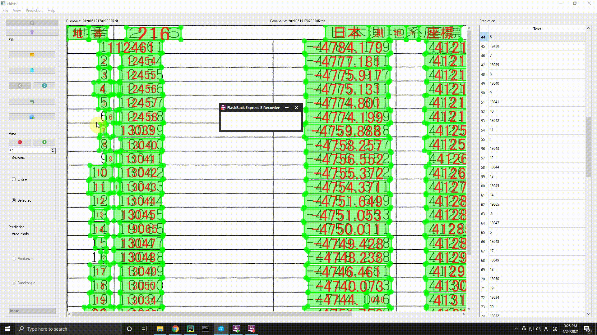
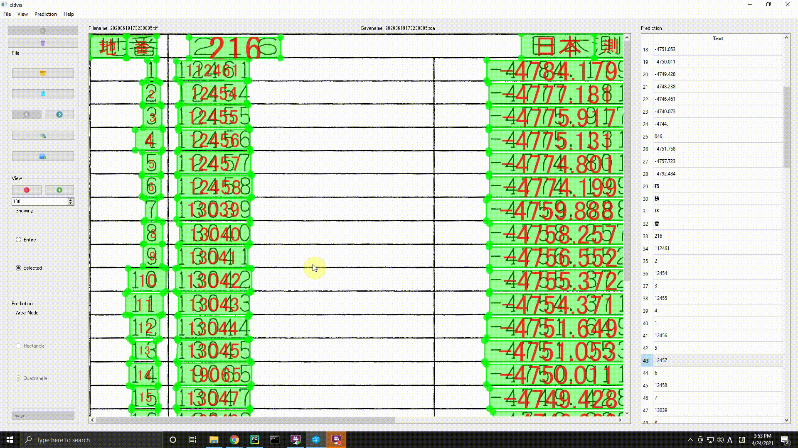

# Cloud Vision Text Modifier
This GUI App allows us to modify results predicted by Google cloud vision OCR.

## OCR


## modification



## Exportation



The exported csv file is like this!

|**地番**|**216**|**日本測地系座標**| | |
|:-----:|:-----:|:-----:|:-----:|:-----:|
|1|112461|-4784.179|41217.032|8.178|
|2|12454|-4777.181|41212.8|2.478|
|3|12455|-4775.917|41214.931|1.701|
|4|12456|-4775.131|41216.439|0.772|
|5|12457|-4774.801|41217.137|1.574|
|6|12458|-4774.199|41218.591|39.712|
|7|13039|-4759.888|41255.635|4.532|
|8|13040|-4758.257|41259.863|4.873|
|9|13041|-4756.552|41264.428|3.677|
|10|13042|-4755.372|41267.911|3.357|
|11|13043|-4754.371|41271.115|9.893|
|12|13044|-4751.649|41280.626|1.999|
|13|13045|-4751.053|41282.534|3.474|
|14|19065|-4750.011|41285.848|1.655|
|15|13047|-4749.428|41287.397|3.562|
|16|13048|-4748.238|41290.754|4.71|
|17|13049|-4746.461|41295.116|15.709|
|18|13050|-4740.073|41309.468|4.289|
|19|13034|-4744.046|41311.085|8.493|
|20|13032|-4751.758|41314.642|6.414|
|21|13030|-4757.723|41316.999|101.984|
|22|12463|-4792.484|41221.122|9.257|
|算|積|H|貝|1894.1588275m'||

The exported xml file (VOC format) is like this!

```xml
<annotation>
  <folder>image</folder>
  <filename>20200619173238005.jpg</filename>
  <size>
    <width>2235</width>
    <height>1415</height>
    <depth>3</depth>
  </size>
  <object>
    <difficult>0</difficult>
    <content>###</content>
    <name>日本</name>
    <bndbox>
      <x1>832</x1>
      <y1/>
      <x2>972</x2>
      <y2/>
      <x3>972</x3>
      <y3>47</y3>
      <x4>832</x4>
      <y4>47</y4>
    </bndbox>
  </object>
  <object>
    <difficult>0</difficult>
    <content>###</content>
    <name>測</name>
    <bndbox>
      <x1>973</x1>
      <y1/>
      <x2>1036</x2>
      <y2/>
      <x3>1036</x3>
      <y3>47</y3>
      <x4>973</x4>
      <y4>47</y4>
    </bndbox>
  </object>

...

```

## ShortCut key
- File management

| ShortCut key | Description |
|:--------------|:-------------|
| `Ctrl+O` | Open a folder  |
| `Ctrl+Shift+O` | Open files |
| `Ctrl+S` | Save a tda file in dataset directory |
| `Ctrl+Shift+S` | Save a tda file in specific location |
| `Ctrl+L` | Load a tda file from specific location |
| `Alt+←` | Back to a previous file |
| `Alt+→` | Forward to a next file  |
| `Ctrl+E` | Export a file for table to specific location |
| `Ctrl+Shift+E` | Export a file for dataset to specific location |
| `Ctrl+Q` | Quit this application |

- Viewer

| ShortCut key | Description |
|:--------------|:-------------|
| `Ctrl++` | Zoom in |
| `Ctrl+-` | Zoom out |
| `Ctrl+Alt+E` | Show the entire image |
| `Ctrl+Alt+R` | Show the selected image |

- prediction

| ShortCut key | Description |
|:--------------|:-------------|
| `Ctrl+P` | Predict texts through google cloud vision API |
| `Ctrl+G` | Finished editing. Auto save will be done and <br>default file name will be renamed by appending the sequence number |
| `Ctrl+D` | Discard the rectangle/quadrangle in selection mode<br>Discard the results in editing annotation mode |
| `r` | Use rectangle for prediction |
| `q` | Use quadrangle for prediction |
| `Ctrl+Shift+I` | Predict texts as Image mode |
| `Ctrl+Shift+D` | Predict texts as Document mode |

| ShortCut key | Description |
|:--------------|:-------------|
| `Ctrl+,` | Open preferences |

# Installation
Set up cloud vision api settings following [official](https://cloud.google.com/vision/docs/quickstart-client-libraries).

And then, for Windows user, download the executable from [here](https://github.com/jjjkkkjjj/cldvis-txtmodifier/releases/download/0.0/cldvis-installer_0.0.exe)

Or, create a environment to run scripts.
```
conda install -c conda-forge pyside2 opencv matplotlib pandas openpyxl lxml
pip install --upgrade google-cloud-vision
pip install --upgrade google-cloud-documentai
```

# For developer

## Installation
```bash
pip install Pyside2 opencv-python pandas openpyxl lxml pyinstaller
pip install --upgrade google-cloud-vision
pip install --upgrade google-cloud-documentai
```

Or

```bash
pip install -f requirements.txt
pip install pyinstaller
```

## build

```bash
cd exe
pyinstaller cldvis.spec
```

or simply double-click `windows.bat` in `exe

## debug
When you want to debug the exe created by Pyinstaller, you should call exe from command line like this;

```bash
cd exe
pyinstaller cldvis-debug.spec
dist\cldviscldvis.exe
```

you can see the log outputs;

```bash
...
[13560] LOADER: extracted pyimod02_archive
[13560] LOADER: callfunction returned...
[13560] LOADER: extracted pyimod03_importers
[13560] LOADER: callfunction returned...
[13560] LOADER: Installing PYZ archive with Python modules.
[13560] LOADER: PYZ archive: PYZ-00.pyz
[13560] LOADER: Running pyiboot01_bootstrap.py
[13560] LOADER: Running pyi_rth_pyside2.py
[13560] LOADER: Running pyi_rth_pkgres.py
[13560] LOADER: Running pyi_rth_certifi.py
[13560] LOADER: Running pyi_rth_multiprocessing.py
[13560] LOADER: Running app_mvc.py
...
```

## trouble shooting
### `pkg_resources.DistributionNotFound: The 'google-cloud-core' distribution was not found and is required by the application`
If you catch `pkg_resources.DistributionNotFound: The 'google-cloud-core' distribution was not found and is required by the application`
, you should try to reisntall `google-cloud-core`!

```bash
pip install google-cloud-core
```

or, set hook.

```bash
cd ~~/site-packages/Pyinstaller/hooks
vi hook-google-cloud.py
```

```python
from PyInstaller.utils.hooks import collect_data_files
datas = collect_data_files('grpc')
```

### `Exception ignored in: 'grpc._cython.cygrpc.ssl_roots_override_callback'`

```bash
Exception ignored in: 'grpc._cython.cygrpc.ssl_roots_override_callback'
E0424 14:05:13.995000000  7832 src/core/lib/security/security_connector/ssl_utils.cc:555] assertion failed: pem_root_certs != nullptr
```
